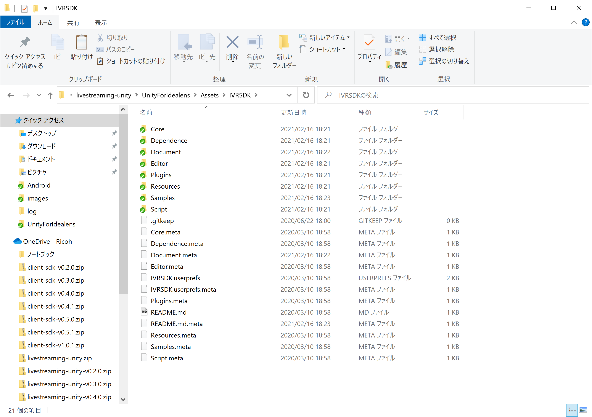
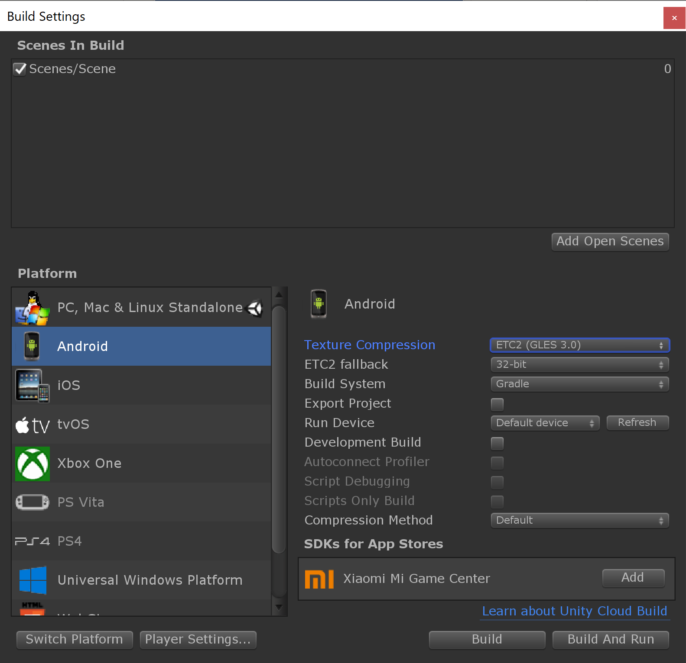
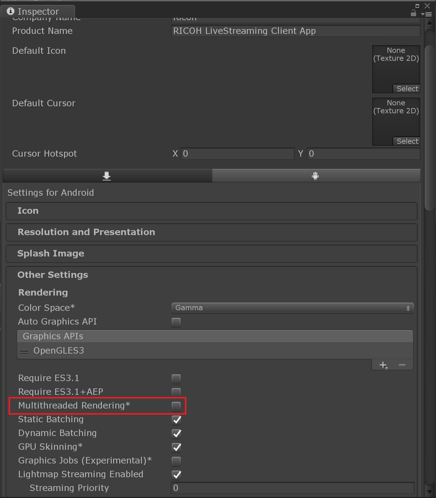

# RICOH Live Streaming Client for IDEALENS

IDEALENS K4上でWebRTCを使用して映像・音声をライブストリーミング受信するアプリ

## 動かし方

1. Unity HubでUnityForIdealensをリストに追加し起動する
2. IVRSDK_Unityを https://github.com/IDEALENSGroup/IVRSDK_Unity/releases/tag/1.2.1 から Source code(zip) を任意の場所にダウンロードする
3. ダウンロードファイルを解凍し、IVRSDK_Unity-1.2.1以下のファイルを UnityForIdealens/Assets/IVRSDK にコピーする




4. `File > Build Settings` を選択し、PlatformをAndroidに変更する
5. Texture CompressionをETC2(GLES 3.0)に変更する




6. Client ID, Secret, Room ID を取得する
7. [設定ファイル](#設定ファイル)を作成する。
8. PlayerSettingsの `Multithreaded Rendering` をOFFにする




9. `File > Build And Run` を選択し、端末にアプリをインストールする

### 設定ファイル

* 以下の書式で `UnityForIdealens/Assets/Scripts/Secrets.cs` を作成する。
  * `client_id` と `client_secret` は実際の値を入れる

```
public static class Secrets
{
    public static readonly string CLIENT_ID = "xxxxxx";
    public static readonly string CLIENT_SECRET = "xxxxxx";
    public static readonly string ROOM_ID = "xxxxxx";
}
```

## アプリの操作方法
* 接続するRoomIDを入力し、Connectボタンをクリックする
  * ConnectボタンのクリックでStreaming受信を開始する
  * RoomIDはConnectボタンを押下すると内部に保存され、次回アプリ起動時に復元される
    * "！"ボタン押下で初期状態に戻る
* コントローラのAPPボタンを押すと表示する拠点が切り替わる
* DualFisheye/Equirectangular表示の際には、コントローラのタッチパッドを左右にスワイプすると表示の向きが切り替わる
* DisconnectボタンをクリックするとStreaming受信が停止される
* ボタン/トグル/コントローラは受信中に一定時間コントローラの操作を行わないと、非表示になる。再表示する場合、コントローラのタッチパッド操作で表示される
* コントローラのHomeボタンを押すとアプリが終了する

## ログ出力機能

`RTCStats` の通知イベントを受け取って 端末のディスク上に書き込む機能がある。

`/storage/emulated/0/Android/data/com.ricoh.livestreaming.idealens/files/logs/20190129T1629.log` という名前で出力される。
ファイル名は実際の日時で `yyyyMMdd'T'HHmm` の形式となる。
接続する度に新しいファイルが生成される。

ファイル形式は [LTSV](http://ltsv.org/) となっている。

すべての情報を出力しているのではなく `candidate-pair`, `outbound-rtp`, `inbound-rtp`, `remote-inbound-rtp`, `track`, `sender`, `media-source` の情報だけ出力している。

その他の情報を出力したい場合は `RTCStatsLogger.cs` を修正する。
出力可能な情報の一覧は https://www.w3.org/TR/webrtc-stats/ で確認できるが、
libwebrtc の実装に依存するため、記載されているすべての情報が出力できるとは限らない。

以下のコマンドで本体ディスク上のログファイルを取得できる。

```sh
$ adb pull /storage/emulated/0/Android/data/com.ricoh.livestreaming.idealens/files/logs
```

### 動作確認済みIVRSDKバージョン
* 1.2.1

### 制限事項
* アプリ起動後に表示されるパーミッション要求画面ですべてのパーミッションを許可後にBTコントローラ(IDEALENS H2)で以下の操作を行うとアプリ落ちが発生することを確認しています

1. BTコントローラのタッチパッドを左にフリック
2. BTコントローラのタッチパッドをクリックもしくはトリガーボタンを押す

* すべてのパーミッション許可後に一旦端末を再起動することにより回避可能です
