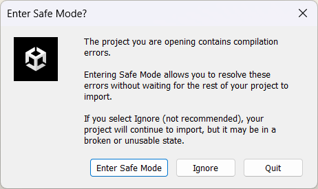
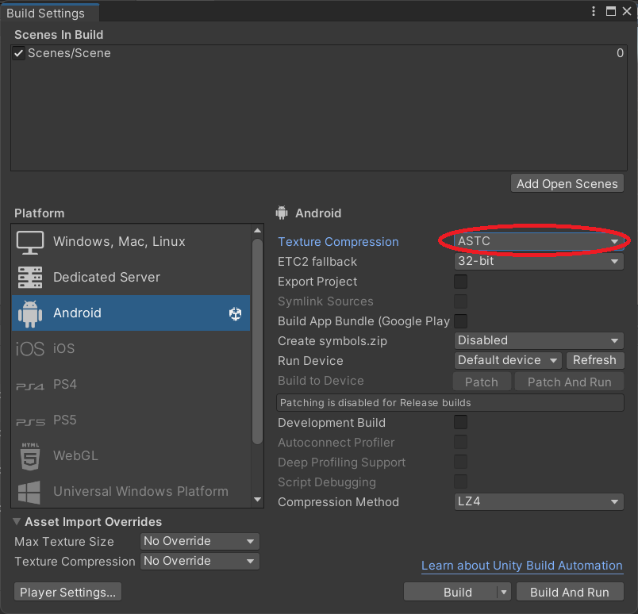

# RICOH Live Streaming Client for Meta Quest

Meta Quest上でWebRTCを使用して映像・音声をライブストリーミング受信するアプリ

## 動かし方

1. Unity Hubでunity-app-oculusをリストに追加し起動する
2. `Enter Safe Mode?` ダイアログが表示されたらIgnoreボタンを選択する



3. `File > Build Settings` を選択し、PlatformをAndroidに変更する
4. Texture Compression を ASTC に変更する



5. Projectの `Assets > Senes` でSceneをダブルクリックする
6. Client ID, Secret, Room ID を取得する
7. [設定ファイル](#設定ファイル)を作成する。
8. `File > Build And Run` を選択し、端末にアプリをインストールする

### 設定ファイル

* 以下の書式で `UnityAppForOculus/Assets/Scripts/Secrets.cs` を作成する。
  * `client_id` と `client_secret` は実際の値を入れる

```
public static class Secrets
{
    public static readonly string CLIENT_ID = "xxxxxx";
    public static readonly string CLIENT_SECRET = "xxxxxx";
    public static readonly string ROOM_ID = "sample-room";
}
```

## アプリの操作方法
* ボタンクリック操作は右コントローラのトリガーボタン
* 接続するRoomIDを入力し、Connectボタンをクリックする
  * ConnectボタンのクリックでStreaming受信を開始する
  * RoomIDはConnectボタンを押下すると内部に保存され、次回アプリ起動時に復元される
    * "！"ボタン押下で初期状態に戻る
* 右コントローラのBボタンをクリックすると表示する拠点が切り替わる
* DualFisheye/Equirectangular表示の際には、右コントローラのスティックを左右に操作すると表示の向きが切り替わる
  * スティックを押し込むと初期表示の向きに戻る
* DisconnectボタンをクリックするとStreaming受信が停止される
* ボタン/トグル/コントローラは受信中に一定時間コントローラの操作を行わないと、非表示になる。再表示する場合、コントローラのいずれかのボタン/スティック操作で表示される

## ログ出力機能

本アプリでは以下のログを出力する。

* Clientログ
  * `/storage/emulated/0/Android/data/com.ricoh.livestreaming.quest/files/logs/quest/` に出力
* libwebrtcログ
  * `/storage/emulated/0/Android/data/com.ricoh.livestreaming.quest/files/logs/libwebrtc/` に出力
* statsログ
  * `/storage/emulated/0/Android/data/com.ricoh.livestreaming.quest/files/logs/stats/` に出力

以下のコマンドで本体ディスク上のログファイルをすべて取得できる。

```sh
$ adb pull /storage/emulated/0/Android/data/com.ricoh.livestreaming.quest/files/logs
```

### Clientログ

ログ出力には SLF4J を使用する。つまりアプリはSLF4Jに対応したログ実装を指定する必要がある。

実装としては [logback-android](https://github.com/tony19/logback-android) を推奨する。logback-android は XML ファイルによりログ出力を細やかに設定可能であり、ファイル等への出力もできる。
ログ出力の設定は `Assets/Plugins/Android/CustomAndroidResource.androidlib/assets/logback.xml` で指定可能。

ログ出力レベルは libwebrtc のログ出力仕様 に倣って `ERROR` / `WARNING` / `INFO` / `TRACE` の 4 段階で設定可能。

設定レベルより上位レベルのログも出力される。つまり TRACE レベルに設定するとすべてのログが出力される。そして最上位の ERROR レベルのログは常に出力される。

アプリログは `/storage/emulated/0/Android/data/com.ricoh.livestreaming.quest/files/logs/quest/quest_20221215T143500.log` という名前で出力される。  
ファイル名は実際の日時で `quest_yyyyMMdd'T'HHmmss.log` の形式となる。

### libwebrtcログ

`Option.Builder#loggingSeverity()` で logcat に出力するログレベルの指定が可能。

また、`Client#setLibWebrtcLogOption()` を利用することで libwebrtc ログも本体のディスク上に `/storage/emulated/0/Android/data/com.ricoh.livestreaming.quest/files/logs/libwebrtc/webrtc_log_0` という名前で出力することができる。

### statsログ

`RTCStats` の通知イベントを受け取って 端末のディスク上に書き込む機能がある。

`/storage/emulated/0/Android/data/com.ricoh.livestreaming.quest/files/logs/stats/20190129T1629.log` という名前で出力される。
ファイル名は実際の日時で `yyyyMMdd'T'HHmm` の形式となる。
接続する度に新しいファイルが生成される。

ファイル形式は [LTSV](http://ltsv.org/) となっている。

すべての情報を出力しているのではなく `candidate-pair`, `outbound-rtp`, `inbound-rtp`, `remote-inbound-rtp`, `track`, `sender`, `media-source` の情報だけ出力している。

その他の情報を出力したい場合は `RTCStatsLogger.kt` を修正する。
出力可能な情報の一覧は https://www.w3.org/TR/webrtc-stats/ で確認できるが、
libwebrtc の実装に依存するため、記載されているすべての情報が出力できるとは限らない。

### 動作確認済みUnityバージョン
* 2022.3.49f1
