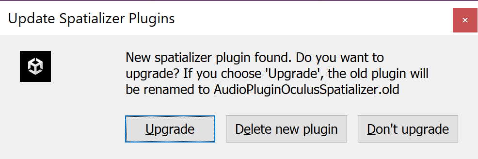

# RICOH Live Streaming Client for Oculus Quest

Oculus Quest上でWebRTCを使用して映像・音声をライブストリーミング受信するアプリ

## 動かし方

1. Unity HubでUnityAppForOculusをリストに追加し起動する
2. OculusIntegrationを https://developer.oculus.com/downloads/package/unity-integration-archive/20.1/ から20.1を選択し、任意の場所にダウンロードする
3. Unity上で `Assets > Import Package > Custom Package` から、ダウンロードした `OculusIntegration_20.1.unitypackage` を選択する
4. `Import Unity Package` ダイアログが表示されたらImportボタンを選択する


5. `File > Build Settings` を選択し、PlatformをAndroidに変更する
6. Projectの `Assets > Senes` でSceneをダブルクリックする
7. Client ID, Secret, Room ID を取得する
8. [設定ファイル](#設定ファイル)を作成する。
9. `Update Oclus Utilities Plugin` ダイアログが表示されたらYESを選択する


10. `Restart Unity` ダイアログが表示されたらRestartを選択する


11. `Update Spatializer Plugins` ダイアログが表示されたらUpgradeを選択する



12. `Restart Unity` ダイアログが表示されたらRestartを選択する


13. Hierarchyの Scene > Scriptsを選択し、InspectorからUIHelpersをダブルクリックする


14. Hierarchyの UIHelpers > EventSystemを選択し、`InspectorのJoy Pad Click Button` を `One` と `Secondary Index Triger` を選択状態に、`Gaze Click Key`を `None` に変更する


15. PlayerSettingsの `Multithreaded Rendering` をONにする


16. `File > Build And Run` を選択し、端末にアプリをインストールする

### 設定ファイル

* 以下の書式で `UnityAppForOculus/Assets/Scripts/Secrets.cs` を作成する。
  * `client_id` と `client_secret` は実際の値を入れる

```
public static class Secrets
{
    public static readonly string CLIENT_ID = "xxxxxx";
    public static readonly string CLIENT_SECRET = "xxxxxx";
    public static readonly string ROOM_ID = "xxxxxx";
}
```

## アプリの操作方法
* ボタンクリック操作は右コントローラのAボタンまたはトリガーボタン
* 接続するRoomIDを入力し、Connectボタンをクリックする
  * ConnectボタンのクリックでStreaming受信を開始する
  * RoomIDはConnectボタンを押下すると内部に保存され、次回アプリ起動時に復元される
    * "！"ボタン押下で初期状態に戻る
* 右コントローラのBボタンをクリックすると表示する拠点が切り替わる
* DualFisheye/Equirectangular表示の際には、左右コントローラのスティックを左右に操作すると表示の向きが切り替わる
  *  スティックを押し込むと初期表示の向きに戻る
* DisconnectボタンをクリックするとStreaming受信が停止される
* ボタン/トグル/コントローラは受信中に一定時間コントローラの操作を行わないと、非表示になる。再表示する場合、コントローラのいずれかのボタン/スティック操作で表示される

## ログ出力機能

`RTCStats` の通知イベントを受け取って 端末のディスク上に書き込む機能がある。

`/storage/emulated/0/Android/data/com.ricoh.livestreaming.oculus/files/logs/20190129T1629.log` という名前で出力される。
ファイル名は実際の日時で `yyyyMMdd'T'HHmm` の形式となる。
接続する度に新しいファイルが生成される。

ファイル形式は [LTSV](http://ltsv.org/) となっている。

すべての情報を出力しているのではなく `candidate-pair`, `outbound-rtp`, `inbound-rtp`, `remote-inbound-rtp`, `track`, `sender`, `media-source` の情報だけ出力している。

その他の情報を出力したい場合は `RTCStatsLogger.kt` を修正する。
出力可能な情報の一覧は https://www.w3.org/TR/webrtc-stats/ で確認できるが、
libwebrtc の実装に依存するため、記載されているすべての情報が出力できるとは限らない。

以下のコマンドで本体ディスク上のログファイルを取得できる。

```sh
$ adb pull /storage/emulated/0/Android/data/com.ricoh.livestreaming.oculus/files/logs
```

### 動作確認済みOculusIntegrationSDKバージョン
- 20.1
